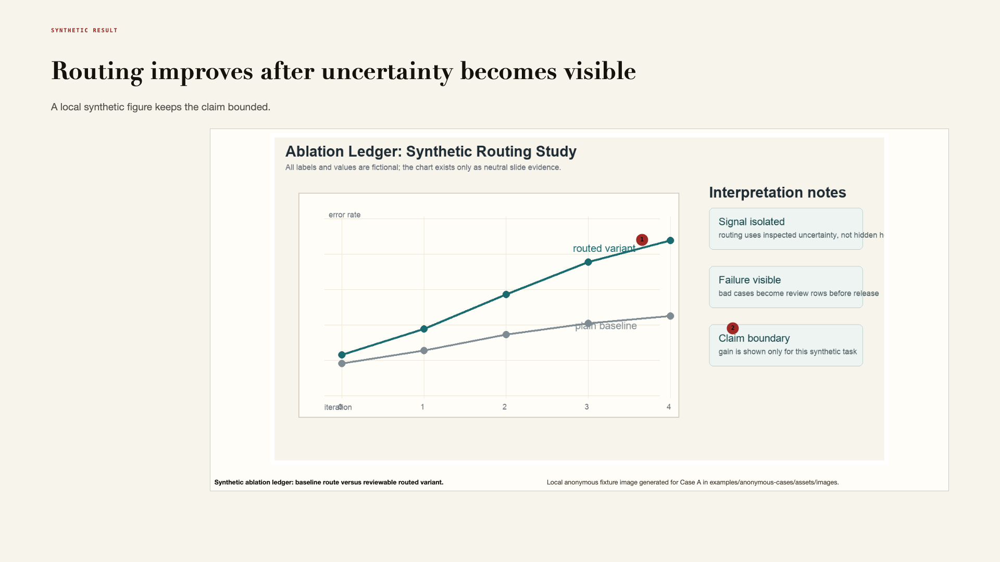
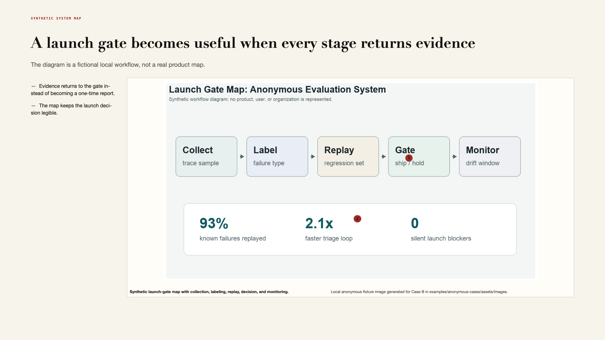
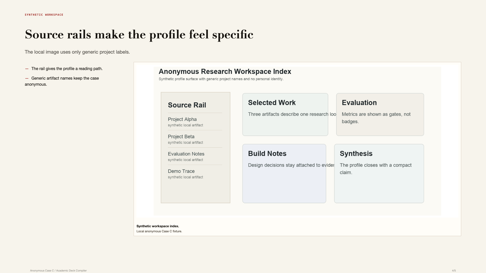

# Auto Academic Slides

一个本地学术/技术 slides 编译器。它不追求“一键生成一套 PPT”，而是把一套好 slides 应该经过的过程固化下来：先有论证，再选证据，再做版式，最后用浏览器审查重叠、裁剪、可读性和导出质量。

[English README](README.md)

## 项目目标

学术汇报和技术分享通常不缺内容，缺的是结构和取舍：

- 标题要说判断，而不是只写主题
- 截图、图表、代码页必须真的能看清
- 版式要有节奏，不要每页都是同一个模板
- HTML 的审美能力要能进入 PPTX / Beamer 交付路线
- 自动化流程必须检查文字重叠、图文冲突、裁剪失败和证据过小

这个项目参考了 [reveal.js](https://github.com/hakimel/reveal.js)、[Slidev](https://github.com/slidevjs/slidev)、[Marp](https://github.com/marp-team/marp) 这类成熟 slides 生态，也吸收了 [beautiful-html-templates](https://github.com/zarazhangrui/beautiful-html-templates) 这种面向编码 agent 的模板选择思路。但它不是这些工具的壳，而是一个独立的 compiler：输入 `deck.yaml`，输出 HTML、PPTX、Beamer/PDF、审查报告和修复线索。

## 安装

```bash
git clone https://github.com/Picrew/auto-academic-sildes.git
cd auto-academic-sildes
uv sync
uv run academic-deck doctor
uv run --with pytest pytest -q
```

`doctor` 会检查本地可选工具，例如 Chrome/Chromium、LaTeX、Poppler、PowerPoint 自动化能力。HTML 和截图式 PPTX 需要浏览器；Beamer 需要 LaTeX。

## 快速开始

新建一个中性 starter deck：

```bash
uv run academic-deck init --out examples/my-talk/deck.yaml
```

渲染前先检查内容和证据：

```bash
uv run academic-deck check --deck examples/my-talk/deck.yaml --out outputs/my-talk
uv run academic-deck evidence --deck examples/my-talk/deck.yaml --out outputs/my-talk
```

走 HTML-first 路线并导出为 PPTX：

```bash
uv run academic-deck html-pptx \
  --deck examples/my-talk/deck.yaml \
  --out outputs/my-talk-html \
  --fail-on-layout
```

在确定最终风格前，先做一次 grammar bake-off：

```bash
uv run academic-deck compare-grammars \
  --deck examples/my-talk/deck.yaml \
  --out outputs/my-talk-grammar-bakeoff \
  --grammars highsense-20 \
  --fail-on-layout
```

如果需要可编辑 PPTX 或 LaTeX/Beamer 备份：

```bash
uv run academic-deck build \
  --deck examples/my-talk/deck.yaml \
  --out outputs/my-talk \
  --fail-on-layout
```

## 匿名案例展示

下面三个匿名 fixture 展示推荐流程：先写 claim-led YAML，使用本地合成证据图，走 HTML-first 渲染和布局审查，最后人工看 contact sheet。源文件在 [`examples/anonymous-cases`](examples/anonymous-cases)，完整 contact sheets 在 [`docs/anonymous_case_gallery`](docs/anonymous_case_gallery)。

| 论文汇报 | 系统评审 | Workspace profile |
|---|---|---|
|  |  |  |

## Agent 推荐用法

这个项目最适合让 Codex 或 Claude Code 通过 repo 内的 skills 来使用，而不是让 agent 直接“凭感觉做一套 PPT”。推荐提示方式是：先调用 skill，让 agent 写或改 `deck.yaml`，再跑质量检查、证据检查、HTML-first 渲染、布局审查、contact sheet 目检和修复循环。

Codex：

```text
$paper-to-html-talk Build a 12-slide HTML-first talk from <paper.pdf>. Use compare-grammars, run with --fail-on-layout, inspect the contact sheet, and package the result.
```

Claude Code：

```text
/paper-to-html-talk Build a 12-slide HTML-first talk from <paper.pdf>. Use compare-grammars, run with --fail-on-layout, inspect the contact sheet, and package the result.
```

常用入口：

- `$academic-deck` / `/academic-deck`：通用学术或技术 slides。
- `$html-first-deck` / `/html-first-deck`：视觉保真优先的 HTML-first deck。
- `$paper-to-html-talk` / `/paper-to-html-talk`：论文汇报、seminar、journal club。
- `$public-profile-deck` / `/public-profile-deck`：基于公开资料的人物、实验室、公司或项目 profile。
- `$deck-iteration-judge` / `/deck-iteration-judge`：已有 contact sheet 后做审美和证据复查。

skills 布局：

- `.codex/skills/` 是详细 skill 的 canonical source，也保留给现有 Codex desktop/local skill 场景。
- `.agents/skills/` 是当前 Codex repo 级发现入口。
- `.claude/skills/` 是 Claude Code repo 级发现入口。

维护 skills 时，先改 `.codex/skills/<skill>/SKILL.md`，再同步桥接入口：

```bash
uv run python scripts/sync_agent_skill_bridges.py
uv run python scripts/sync_agent_skill_bridges.py --check
```

## 流程

```text
论文 / 项目 / 笔记
        ↓
deck.yaml
        ↓
内容质量检查 + 图片证据检查
        ↓
HTML renderer ── 浏览器布局审查 ── contact sheet ── 图片式 PPTX
        ↓
可选：原生可编辑 PPTX / Beamer 备份
        ↓
grammar 对比 / repair hints / review package
```

默认判断：HTML 是设计源文件。PPTX-native 适合需要编辑的场景；Beamer 适合正式 PDF 和 LaTeX-first 环境。

## Deck 写法

每一页都应该有一个 action title。对于论文图、网页截图、仓库页、表格、UI、benchmark 等证据，使用 `evidence`，不要直接扔一张裸图：

```yaml
- kind: evidence
  kicker: Result
  title: The strongest figure should carry the result slide
  layout: proof-showcase
  bullets:
    - Keep only the part of the figure that proves the headline.
  evidence:
    image: assets/images/result-crop.png
    crop: {x: 0.08, y: 0.12, w: 0.78, h: 0.70}
    caption: Main comparison: the proposed method keeps accuracy stable under distribution shift.
    source: Paper figure or project artifact, accessed 2026-05-30.
    callouts:
      - {x: 0.62, y: 0.38, text: stable region}
```

完整 schema 见 [docs/IR.md](docs/IR.md)。

## 风格系统

项目内置多组 visual grammar：academic homepage、source ledger、paper note、gallery proof room、systems board、field manual，以及受 beautiful-html-templates 启发的 `signal-intelligence-brief`、`raw-grid-research`、`stencil-field-tablet` 等。

常用 preset：

- `highsense-20`：优先用于学术/技术 slides 的第一轮高审美筛选
- `reference-20`：同一个 curated pool 的别名
- 默认 compare pool：更大范围的回归和探索

如果你只有“气质描述”，可以先做模板 shortlist：

```bash
uv run academic-deck template-shortlist \
  --brief "academic research profile, source evidence, quiet high taste" \
  --out outputs/template-shortlist
```

如果本地有 `vendor/beautiful-html-templates`，命令会读取完整 `index.json`；如果没有，会使用内置的学术安全 shortlist。

更多见 [docs/VISUAL_GRAMMARS.md](docs/VISUAL_GRAMMARS.md) 和 [docs/DESIGN_REFERENCE_SYNTHESIS.md](docs/DESIGN_REFERENCE_SYNTHESIS.md)。

## 严格检查

`--fail-on-layout` 会把这些问题当成 blocker：

- 文字重叠、自重叠、裁切、行高过紧
- 文字和图片碰撞，或图文间距过紧
- proof image 缺失、没有 crop、没有 caption/source
- 证据图太小、严重 letterbox、源像素不足
- callout pin 不在真实渲染图片范围内
- bullet、metric、label、caption 超预算
- 未知 visual grammar

输出里重点看三个报告：`quality-report.md`、`evidence-report.md`、`layout-audit-report.md`。报告干净之后，再看 contact sheet 判断品味和节奏。

## 常用命令

```bash
uv run academic-deck init --out examples/my-talk/deck.yaml
uv run academic-deck init --example portfolio --out examples/profile-fixture/deck.yaml
uv run academic-deck ingest --source /path/to/source-folder --out outputs/source-pack
uv run academic-deck check --deck examples/my-talk/deck.yaml --out outputs/my-talk
uv run academic-deck evidence --deck examples/my-talk/deck.yaml --out outputs/my-talk
uv run academic-deck html-pptx --deck examples/my-talk/deck.yaml --out outputs/my-talk-html
uv run academic-deck compare-grammars --deck examples/my-talk/deck.yaml --out outputs/my-talk-grammar-bakeoff
uv run academic-deck repair-plan --manifest outputs/my-talk-grammar-bakeoff/GRAMMAR_REPAIR_HINTS.json --out outputs/my-talk-grammar-bakeoff
uv run academic-deck repair-draft --deck examples/my-talk/deck.yaml --manifest outputs/my-talk-grammar-bakeoff/GRAMMAR_REPAIR_HINTS.json --out outputs/my-talk-repair-draft
uv run academic-deck build --deck examples/my-talk/deck.yaml --out outputs/my-talk
uv run academic-deck package --deck examples/my-talk/deck.yaml --out outputs/my-talk
```

## 仓库结构

```text
src/academic_deck_compiler/   compiler、renderer、audit、CLI
templates/                    visual grammar 设计说明
examples/                     可公开的中性样例
docs/                         架构、流程、证据、风格说明
.codex/skills/                详细 deck skills 的 canonical source
.agents/skills/               生成的 Codex skill 桥接入口
.claude/skills/               生成的 Claude Code skill 桥接入口
tests/                        单测和 smoke tests
```

真实人物测试样例、个人作品集、生成截图、渲染出的 PPTX/PDF 都不进公开仓库。规则见 [docs/PUBLICATION_POLICY.md](docs/PUBLICATION_POLICY.md)。

## 文档

- [项目流程](docs/PROJECT_FLOW.md)
- [IR / deck.yaml 合约](docs/IR.md)
- [HTML-first 架构](docs/HTML_FIRST_ARCHITECTURE.md)
- [Agent workflow](docs/AGENT_WORKFLOW.md)
- [Public profile workflow](docs/PUBLIC_PROFILE_WORKFLOW.md)
- [图片证据规则](docs/IMAGE_EVIDENCE.md)
- [Visual grammars](docs/VISUAL_GRAMMARS.md)
- [Visual QA](docs/VISUAL_QA.md)
- [发布边界](docs/PUBLICATION_POLICY.md)
- [匿名案例图库](docs/anonymous_case_gallery)

## 限制

- HTML-image PPTX 保真度高，但不是深度可编辑。
- PPTX-native 可编辑，但视觉表现不如 HTML route。
- 密集论文图仍然需要认真裁剪或重画。
- 浏览器截图、LaTeX、PowerPoint PDF export 都依赖本地工具。
- visual judge 只是第一层启发式判断，最终仍要看 contact sheet。
